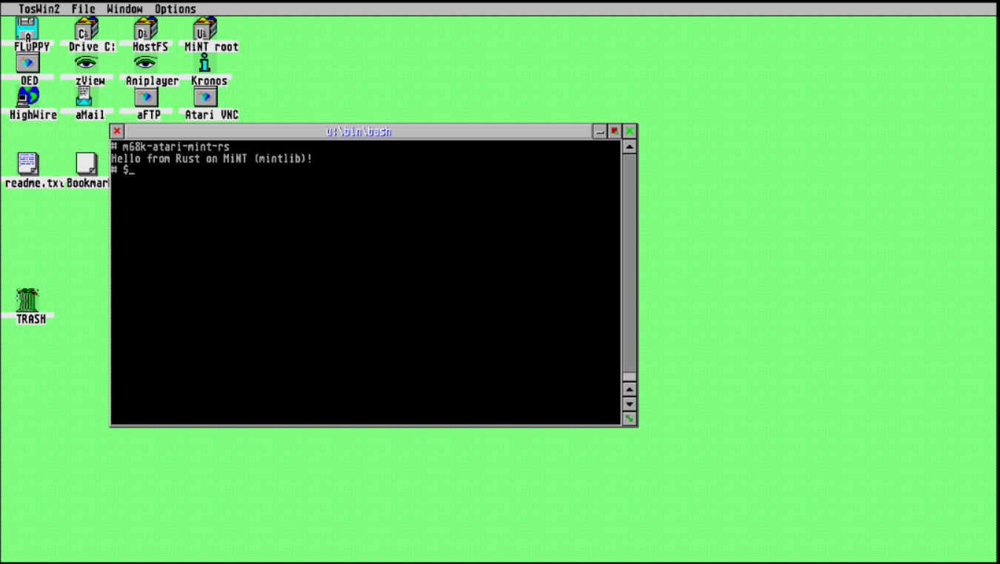

# Compiling Rust Core to m68k



```sh
$ hatari-prg-args -q \
    --tos ~/current/libcmini/emutos-512k/etos512us.img \
    --conout 2 \
    -- "$(pwd)/m68k-atari-mint-rs"
...
Hello from Rust on MiNT (mintlib)!
```

This repository has a "Hello world" example that compiles no_std rust
code using the Atari Mint GCC toolchain.

You'll need the `m68k-atari-mintelf-gcc` compiler as well as the `m68k-atari-mintelf-binutils` 
from [Thorsten Otto's Crossmint](https://tho-otto.de/crossmint.php).

You'll need the sysroot in the usual location or you can manually pass
the sysroot in the `pre-link-args`, e.g:

```json
...
  "pre-link-args": {
    "gcc": [
      "--sysroot=$SYSROOT_LOCATION",
      "-no-pie"
    ]
  },
...
```


Afterwards, running `cargo build` will build a binary that can be run on
hatari and aranym. 

If you want to build only for a given CPU, say m68020, pass it into the
`pre-link-args`.

```json
...
  "pre-link-args": {
    "gcc": [
      "-m68020",
      "-no-pie"
    ]
  },
...
```

